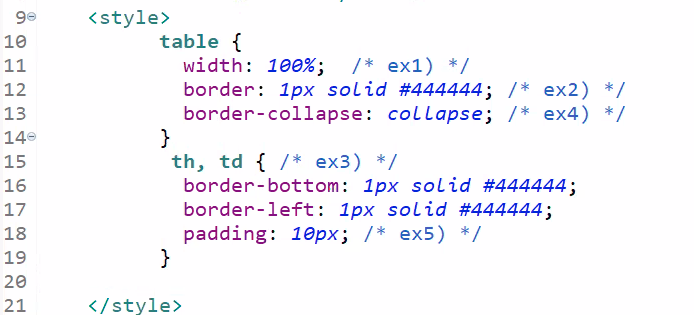

# JSP

## HTML문법에서 필요할 때 자바 코드를 넣자.

---

> 서블릿에서 느꼈던 부족한점을 개선해보자.

HTML이나 자바스크립트에 의해 작성된 페이지들은 그 페이지를 사용하는 사용자와 상관없이 항상 동일한 내용만을 제공해주는 정적 페이지이다.

하지만 웹 프로그램들은 사용자에 따라 서로 다른 내용이 제공되어야 하는데 이러한 동적 페이지를 구현하기 위해서는 jsp태그를 사용하여야 한다.

### 태그

1. 선언 태그

   ```jsp
   <%!-- 선언 태그 --%>
   ```

2. 실행 태그

   ```jsp
   <%-- 실행 태그 --%>
   ```

3. 출력 태그

   ```jsp
   <%=-- 츨력 태그 --%>
   ```

​	

